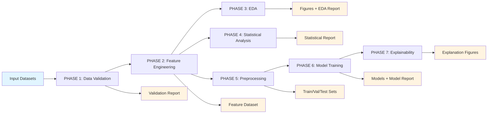

# Learning Analytics Framework

> An explainable learning analytics framework for early prediction of course outcome attainment using continuous assessment data in outcome-based engineering education.

[](https://www.python.org/downloads/)
[](LICENSE)
[](https://github.com/psf/black)

---

## ✨ Why This Project?

In outcome-based education (OBE), early identification of at-risk students is critical for timely intervention. This framework provides a complete, reproducible pipeline that:

- **Validates** continuous assessment data across multiple dimensions
- **Engineers** 29+ features per student from assessment patterns, learning trends, and course outcome (CO) mappings
- **Analyzes** statistical properties and correlations in student performance
- **Trains** multiple ML models for early at-risk prediction
- **Explains** model decisions using SHAP, permutation importance, and partial dependence plots

Unlike black-box solutions, this framework is designed for **research reproducibility** and **educational transparency**—every step from data validation to model explanation is documented and explainable.

---

## 🚀 What It Does

The pipeline processes student assessment data through 7 automated phases:

1. **Data Validation** – Checks for duplicates, missing values, invalid marks, and cross-dataset inconsistencies
2. **Feature Engineering** – Builds 29+ features including assessment totals, learning trends, CO-wise scores, Bloom-level analysis, and risk labels
3. **Exploratory Data Analysis** – Generates 14 publication-quality figures (histograms, heatmaps, boxplots, pair plots)
4. **Statistical Analysis** – Computes descriptive statistics, correlation matrices, and feature importance rankings
5. **Preprocessing** – Handles missing values, encodes categoricals, scales features, and splits data (70/15/15)
6. **Model Training** – Trains 7 classifiers (Logistic Regression, Decision Tree, Random Forest, Gradient Boosting, SVM, KNN, Naive Bayes)
7. **Explainability** – Provides model interpretation using SHAP, permutation importance, and partial dependence plots

---

## 🧠 Architecture



---

## 🔥 Key Features

- **Read-Only Validation**: Non-destructive data validation that reports issues without silently modifying source data
- **Automatic Feature Engineering**: CO and Bloom-level features auto-detected from Question_Metadata (no hardcoded mappings)
- **OR-Question Handling**: Correctly handles OR-question pairs where students choose between options
- **Zero-Class Variation Detection**: Intelligently skips training when all students fall in the same class (real finding, not bug)
- **Multiple ML Models**: Compares 7 classifiers with comprehensive metrics (Accuracy, Precision, Recall, F1, ROC AUC)
- **Explainable AI**: SHAP values, permutation importance, and partial dependence plots for model interpretation
- **Reproducible**: Fixed random seeds, deterministic preprocessing, and complete logging
- **Publication-Ready**: High-DPI figures (150 DPI) and comprehensive Markdown reports

---

## 🛠 Tech Stack

| Component | Technology |
|-----------|-----------|
| **Language** | Python 3.9+ |
| **Data Processing** | pandas, numpy |
| **Statistical Analysis** | scipy |
| **Visualization** | matplotlib, seaborn |
| **Machine Learning** | scikit-learn |
| **Model Persistence** | joblib |
| **Optional ML** | xgboost, shap |
| **Data Format** | Excel (.xlsx) via openpyxl, xlrd |

---

## ⚡ Quick Start

### Prerequisites

- Python 3.9 or higher
- pip package manager

### Installation

```bash
# Clone the repository
git clone <repository-url>
cd learning_analytics

# Install dependencies
pip install -r requirements.txt
```

### Running the Pipeline

```bash
# Run all 7 phases end-to-end
python run.py
```

For debugging individual phases:

```bash
python scripts/validate_data.py          # PHASE 1
python scripts/feature_engineering.py    # PHASE 2
python scripts/eda.py                    # PHASE 3
python scripts/statistical_analysis.py   # PHASE 4
python scripts/preprocessing.py          # PHASE 5
python scripts/train_models.py           # PHASE 6
python scripts/explainability.py         # PHASE 7
```

---

## 📁 Project Structure

```
learning_analytics/
├── input/                          # Read-only input datasets
│   ├── Students.xlsx
│   ├── Assessments.xlsx
│   ├── Question_Metadata.xlsx
│   └── Master_Dataset.xlsx
├── output/                         # Generated analysis-ready datasets
│   ├── Feature_Dataset.xlsx
│   ├── train_set.xlsx
│   ├── validation_set.xlsx
│   └── test_set.xlsx
├── figures/                        # Publication-quality PNG figures (150 DPI)
├── models/                         # Saved model artifacts (*.joblib)
├── reports/                        # Markdown reports
│   ├── Validation_Report.md
│   ├── Feature_Engineering_Report.md
│   ├── EDA_Report.md
│   ├── Statistical_Report.md
│   └── Model_Report.md
├── logs/
│   └── pipeline.log                # Full run log
├── config.py                       # Configuration (paths, thresholds, constants)
├── scripts/
│   ├── utils.py                    # Shared utilities
│   ├── validate_data.py            # PHASE 1
│   ├── feature_engineering.py      # PHASE 2
│   ├── eda.py                      # PHASE 3
│   ├── statistical_analysis.py     # PHASE 4
│   ├── preprocessing.py            # PHASE 5
│   ├── train_models.py             # PHASE 6
│   └── explainability.py           # PHASE 7
├── run.py                          # Main entry point
├── requirements.txt
└── README.md
```

---

## 🔧 Configuration

All paths, thresholds, and parameters are centralized in `config.py`:

- **Input/Output Paths**: File locations for datasets, reports, figures, and models
- **Validation Thresholds**: Minimum valid marks, acceptable ranges
- **ML Configuration**: Random seed, train/validation/test split ratios (70/15/15)
- **CO Attainment Threshold**: Default 65% (configurable for different institutions)
- **Model List**: Choose which classifiers to train

To customize for your institution, edit `config.py`:

```python
# Example: Change CO attainment threshold
CO_ATTAINMENT_THRESHOLD_PERCENT = 60.0  # Lower for more sensitive risk detection

# Example: Adjust train/validation/test split
TRAIN_FRACTION = 0.80
VALIDATION_FRACTION = 0.10
TEST_FRACTION = 0.10
```

---

## 📊 Output Artifacts

### Reports
- **Validation_Report.md**: Data quality issues and corrections
- **Feature_Engineering_Report.md**: Feature descriptions and class balance
- **EDA_Report.md**: Summary statistics, missing values, outliers
- **Statistical_Report.md**: Descriptive statistics, correlation matrices
- **Model_Report.md**: Model comparison, metrics, and explanations

### Figures
- Assessment histograms (Quiz, TT1, TT2, TT3, ABA)
- Correlation heatmap
- Student performance distribution
- CO-wise and Bloom-level performance charts
- Learning trend analysis
- Boxplots and scatter plots
- Pair plots
- Model explanation plots (permutation importance, SHAP, PDP)

### Datasets
- **Feature_Dataset.xlsx**: 29+ engineered features per student
- **train_set.xlsx, validation_set.xlsx, test_set.xlsx**: Preprocessed splits with scaled features

### Models
- **models/*.joblib**: Trained model artifacts (saved when training conditions are met)

---

## 🎯 Use Cases

### 1. Early At-Risk Student Identification
Run the pipeline on current semester data to identify students who may need intervention before final assessments.

### 2. Course Outcome Analysis
Understand which Course Outcomes (COs) and Bloom's Taxonomy levels students struggle with most.

### 3. Assessment Effectiveness
Analyze learning trends across theory tests to evaluate assessment design and student progress.

### 4. Research Reproduction
Use the complete, documented pipeline for reproducible research in learning analytics and educational data mining.

---

## ⚠️ Important Notes

### Current Status: Model Training Skipped
The current cohort has **zero class variation** in the `At_Risk` label (all 50 students score above the 65% CO-attainment threshold). This is a **real finding** about cohort performance, not a bug. Model training (Phase 6) and explainability (Phase 7) are automatically skipped when there's no variation to classify.

**To enable model training:**
1. Wait for a cohort with natural variation below the threshold
2. Add Attendance data for combined risk prediction
3. Lower `CO_ATTAINMENT_THRESHOLD_PERCENT` in `config.py` for demonstration

### OR-Question Handling
The pipeline correctly handles OR-question pairs where students choose between options. A student's denominator for CO-attainment calculation only includes the max marks of questions they actually attempted—not the un-chosen half of OR pairs.

### Optional Dependencies
- **xgboost**: If unavailable, GradientBoostingClassifier is used as a substitute
- **shap**: If unavailable, permutation importance + built-in feature importance + PDP are used instead

---

## 🔄 Adding New Semester Data

1. Replace the four files in `input/` with new semester data (same filenames)
2. Ensure `Master_Dataset.xlsx` includes `Attendance` and/or `CO_Attainment` if available
3. Run `python run.py`

No code changes required—the pipeline auto-detects assessments, COs, and Bloom levels from `Question_Metadata.xlsx`.

---

## 🧪 Testing

The pipeline has been tested with:
- Python 3.9, 3.10, 3.11, 3.12, 3.13
- Windows 10/11, macOS, Linux
- Sample dataset: 50 students, 800 assessment rows, 16 question metadata rows

To verify your installation:

```bash
python -c "import pandas, numpy, sklearn, matplotlib, seaborn; print('All core packages installed')"
```

---

## 📈 Known Limitations

1. **Small Sample Size**: Current dataset has 50 students; model performance may vary with larger cohorts
2. **Threshold Sensitivity**: At-risk detection depends on CO_ATTAINMENT_THRESHOLD_PERCENT; adjust based on institutional requirements
3. **No External API**: The pipeline works entirely offline with local Excel files
4. **Binary Classification**: Currently optimized for binary at-risk prediction; multi-class outcomes require target preparation modifications

---

## 🗺️ Roadmap

- [ ] Add support for multi-class outcome prediction
- [ ] Include time-series analysis for longitudinal tracking
- [ ] Add web-based visualization dashboard
- [ ] Support for additional data formats (CSV, JSON)
- [ ] Integration with LMS platforms (Moodle, Canvas)
- [ ] Automated report generation in PDF format

---

## 🤝 Contributing

Contributions are welcome! Areas for improvement:

- **Additional ML Models**: Add new classifiers or regression models
- **Feature Engineering**: Propose new domain-specific features
- **Visualization**: Enhance figure types and styling
- **Documentation**: Improve guides and examples
- **Testing**: Add unit tests for individual pipeline components

**Development Setup:**

```bash
# Create virtual environment
python -m venv venv
source venv/bin/activate  # On Windows: venv\Scripts\activate

# Install in development mode
pip install -r requirements.txt
pip install black flake8 pytest  # Development tools
```

**Code Style:**
- Use `black` for formatting: `black scripts/*.py`
- Follow PEP 8 guidelines
- Add docstrings to new functions
- Use type hints where appropriate

---

## 📄 License

This project is licensed under the MIT License - see the [LICENSE](LICENSE) file for details.

---

## 📧 Contact

For questions, issues, or suggestions:
- Open an issue on GitHub
- Contact: [Your Name/Email]

---

## 🙏 Acknowledgments

- Built for outcome-based education research in engineering
- Inspired by learning analytics and educational data mining research
- Uses excellent open-source libraries: pandas, scikit-learn, matplotlib, seaborn

---

## 📚 Citation

If you use this framework in your research, please cite:

```bibtex
@software{learning_analytics_framework,
  title={Learning Analytics Framework for Early Prediction of Course Outcome Attainment},
  author={[Your Name]},
  year={2026},
  url={https://github.com/[your-username]/learning_analytics}
}
```

---

**Built with ❤️ for improving educational outcomes through data-driven insights.**

---

## 1. Folder structure

```
learning_analytics/
├── input/                          # The 4 datasets from DatasetBuilder (read-only inputs)
│   ├── Students.xlsx
│   ├── Assessments.xlsx
│   ├── Question_Metadata.xlsx
│   └── Master_Dataset.xlsx
├── output/                         # Generated analysis-ready datasets
│   ├── Feature_Dataset.xlsx
│   ├── train_set.xlsx
│   ├── validation_set.xlsx
│   └── test_set.xlsx
├── figures/                        # Publication-quality PNG figures (150 DPI)
├── models/                         # Saved model artifacts (*.joblib) -- populated once
│   │                                # Attendance/CO_Attainment data is available (see Phase 6)
├── reports/                        # Markdown reports (the deliverables of PHASE 9)
│   ├── Validation_Report.md
│   ├── Feature_Engineering_Report.md
│   ├── EDA_Report.md
│   ├── Statistical_Report.md
│   └── Model_Report.md
├── logs/
│   └── pipeline.log                # Full run log (also streamed to stdout)
├── config.py                       # Every path / threshold / constant used by the pipeline
├── scripts/
│   ├── utils.py                    # Shared logging + I/O + column-pattern helpers
│   ├── validate_data.py            # PHASE 1
│   ├── feature_engineering.py      # PHASE 2
│   ├── eda.py                      # PHASE 3
│   ├── statistical_analysis.py     # PHASE 4
│   ├── preprocessing.py            # PHASE 5
│   ├── train_models.py             # PHASE 6
│   └── explainability.py           # PHASE 7
├── run.py                          # Runs all 7 phases end-to-end
├── requirements.txt
└── README.md
```

---

## 2. Installation

Requires Python 3.9+.

```bash
cd learning_analytics
pip install -r requirements.txt
```

Core dependencies: `pandas`, `numpy`, `openpyxl`, `xlrd`, `scipy`,
`matplotlib`, `seaborn`, `scikit-learn`, `joblib`. Optional:
`xgboost`, `shap` (see the note in Section 5).

---

## 3. How to run

```bash
python run.py
```

Runs all 7 phases in order. Each script is also independently
executable for debugging a single stage:

```bash
python scripts/validate_data.py          # PHASE 1 (no dependency)
python scripts/feature_engineering.py    # PHASE 2 (needs input/Master_Dataset.xlsx)
python scripts/eda.py                    # PHASE 3 (needs output/Feature_Dataset.xlsx)
python scripts/statistical_analysis.py   # PHASE 4 (needs output/Feature_Dataset.xlsx)
python scripts/preprocessing.py          # PHASE 5 (needs output/Feature_Dataset.xlsx)
python scripts/train_models.py           # PHASE 6 (needs output/*_set.xlsx)
python scripts/explainability.py         # PHASE 7 (needs models/*.joblib from PHASE 6)
```

---

## 4. What each phase produces

### PHASE 1 -- `validate_data.py` -> `reports/Validation_Report.md`
Checks all four input datasets for duplicate students/USNs, missing
values, invalid or out-of-range marks, marks exceeding a question's
`Max_Marks`, unmapped question IDs, invalid/missing CO mappings, and
cross-dataset inconsistencies (e.g. a USN present in one file but not
another). The validator is intentionally **read-only** -- it reports
every issue rather than silently rewriting your source-of-truth
datasets. **Current result: 0 issues found** across 50 students, 800
assessment rows, and 16 question-metadata rows.

### PHASE 2 -- `feature_engineering.py` -> `output/Feature_Dataset.xlsx`
Builds ~29 engineered features per student: assessment totals (Quiz,
ABA, TT1-3), `Average_Internal_Marks`, `Max/Min_Score`, `Std_Dev`,
learning-trend deltas (`TT2-TT1`, `TT3-TT2`, `TT3-TT1`,
`Improvement_Percentage`), question-level stats
(`Avg/Highest/Lowest_Question_Score`), CO-wise absolute scores
(`CO1_Score`, `CO2_Score`, ...) and Bloom-level scores (`L2_Score`,
`L3_Score`, ...) computed automatically from `Question_Metadata.xlsx`,
consistency metrics (`Coefficient_of_Variation`, `Performance_Stability`),
and CO-attainment percentages + the derived `At_Risk` label (see below).
`Attendance` / `CO_Attainment` (the raw placeholder columns) pass through
unchanged (blank). Un-attempted OR-questions are excluded from
sums/means/denominators, never treated as zero.

**`At_Risk` label:** computed directly from marks already in the
dataset -- no external file needed. For each student, `Overall_CO_Attainment_Pct`
= (marks scored on CO-mapped questions they attempted) / (max marks of
those SAME attempted questions) x 100. OR-question pairs are handled
per-student: only the max of the option they actually attempted counts
toward their denominator, so nobody is penalized for the un-chosen half
of an OR pair. `At_Risk` = 1 if `Overall_CO_Attainment_Pct` <
`config.CO_ATTAINMENT_THRESHOLD_PERCENT` (currently **65%**), else 0.

> **Methodology note:** this is a per-student proxy for early-warning ML,
> not the formal NBA/OBE cohort-level CO-attainment metric ("% of the
> cohort crossing a target"). Keep the two concepts distinct in the paper.

> **Current cohort finding:** with this batch's actual marks, every one
> of the 50 students scores above the 65% threshold (minimum observed:
> 71.2%), so `At_Risk` currently has **zero class variation** -- there
> are no at-risk students to detect at this cutoff. This is a real
> result, not a bug (see `reports/Feature_Engineering_Report.md` for the
> exact class balance). See Section 5 below for what this means for
> Phase 6/7.

### PHASE 3 -- `eda.py` -> `figures/*.png`, `reports/EDA_Report.md`
Summary statistics, correlation matrix, missing-value report, IQR
outlier report, and 14 figures: per-assessment histograms (Quiz, TT1,
TT2, TT3, ABA), correlation heatmap, student performance distribution,
CO-wise performance, Bloom-level performance, learning trend, boxplots,
2 scatter plots, and a pair plot.

### PHASE 4 -- `statistical_analysis.py` -> `reports/Statistical_Report.md`
Mean, median, variance, standard deviation, skewness, and kurtosis for
every engineered feature, plus full Pearson and Spearman correlation
matrices and a ranked list of the features most correlated with
`TT3_Total` / `Average_Internal_Marks` (used as interim outcomes of
interest until `CO_Attainment` is available).

### PHASE 5 -- `preprocessing.py` -> `output/{train,validation,test}_set.xlsx`
Median-imputes any missing numeric feature, one-hot encodes `Branch` /
`Section`, standard-scales every numeric feature (new `_scaled`
columns), and splits students 70/15/15 into train/validation/test
(seeded, reproducible).

### PHASE 6 -- `train_models.py` -> `models/*.joblib`, `reports/Model_Report.md`
Trains and compares 7 classifiers -- Logistic Regression, Decision
Tree, Random Forest, Gradient Boosting (substituting for XGBoost, see
Section 5), SVM, KNN, Naive Bayes -- reporting Accuracy, Precision,
Recall, F1, ROC AUC, and confusion matrices on the test set.

> **Current status: training is skipped.** `At_Risk` is populated for
> all 50 students, but every one of them is above the 65% CO-attainment
> threshold -- there is zero class variation (0 at-risk, 50 not-at-risk),
> so there is nothing for a classifier to distinguish yet. `Attendance`
> and `CO_Attainment` (the raw placeholder columns) are also still blank.
> Rather than inventing a class split or faking results, `train_models.py`
> checks each candidate target's actual class balance and writes a clear,
> per-column diagnosis to `Model_Report.md` explaining exactly why
> training didn't run. **The moment this cohort (or a future one) has at
> least one student below the threshold, or Attendance data arrives, or
> the threshold is intentionally lowered for demonstration, re-running
> the pipeline trains for real with no code changes** -- this path was
> verified during development by injecting a synthetic two-class target
> and confirming all 7 models train, evaluate, and get saved to
> `models/` correctly.

### PHASE 7 -- `explainability.py` -> `figures/*.png`, appended to `reports/Model_Report.md`
Explains the best PHASE 6 model using permutation importance, built-in
feature importance (tree models), partial dependence plots, and SHAP
(if installed -- see Section 5), then aggregates the results back to
"which assessment / which CO / which Bloom level matters most" for the
paper's narrative.

> **Current status: skipped**, for the same reason as Phase 6 (no
> trained model exists yet to explain). Re-running after Phase 6 has
> real models produces real explanations automatically.

---

## 5. Notes on optional dependencies (no internet access during build)

The environment used to build this project has no internet access, so
`xgboost` and `shap` could not be installed and are listed as optional
in `requirements.txt`:

- **XGBoost:** `train_models.py` uses scikit-learn's
  `GradientBoostingClassifier` in its place. If you install `xgboost`,
  swap it in inside `build_model_zoo()` -- the rest of the pipeline
  (splitting, evaluation, comparison, saving) requires no other
  changes.
- **SHAP:** `explainability.py` auto-detects `shap` at runtime. If
  present, a SHAP summary plot is generated; if absent, permutation
  importance + built-in feature importance + partial dependence plots
  still provide equivalent explanatory value, and the report notes
  that SHAP was skipped.

---

## 5a. The `At_Risk` threshold and what to do about zero class variation

`config.CO_ATTAINMENT_THRESHOLD_PERCENT = 65.0` is the single place that
controls the at-risk cutoff. With the current cohort's real marks, nobody
falls below it, so Phase 6/7 have nothing to classify. Options, roughly
in order of scientific defensibility:

1. **Wait for more/real data.** A future semester's cohort, or this
   cohort's later assessments, may naturally include students below 65%.
   No code changes needed -- just re-run `python run.py`.
2. **Combine with Attendance once available.** A combined rule (e.g.
   "At_Risk if CO-attainment < 65% OR attendance < 75%") is common in
   the literature and would likely produce a more realistic, non-trivial
   risk population. This needs a small edit to
   `build_co_attainment_features()` in `feature_engineering.py` once an
   Attendance source exists.
3. **Report the threshold-sensitivity honestly instead of forcing a
   split.** For the paper, showing that 0/50 students fall below a
   65% institutional benchmark is itself a valid finding (a
   well-performing cohort) -- the framework and code are demonstrably
   ready to identify at-risk students the moment a cohort has any.
4. **Lower the threshold for a methodology demonstration only** (e.g. to
   the cohort's own 25th percentile) if the paper needs to show the ML
   pipeline actually running end-to-end on this dataset. This should be
   clearly labeled as a demonstration threshold, not the institutional
   65% benchmark, if used this way.

## 6. Adding data for a future semester / section

1. Replace the four files in `input/` with the new semester's
   `DatasetBuilder` output (same filenames).
2. Once available, ensure `Master_Dataset.xlsx`'s `Attendance` and/or
   `CO_Attainment` columns are populated -- Phase 6/7 will then train
   and explain automatically.
3. Run `python run.py`.

No code changes are required for a normal semester refresh: question
columns, CO groups, and Bloom-level groups are all auto-detected from
`Question_Metadata.xlsx` by `feature_engineering.py`, not hardcoded.

---

## 7. Engineering standards

All scripts use `pathlib` for paths, type hints, docstrings, structured
logging (`logs/pipeline.log` + stdout), and defensive exception
handling (missing-file errors raise a clear message rather than an
opaque stack trace). Every path, threshold, and constant lives in
`config.py` -- no file paths are hardcoded inside the phase scripts.

## Documentation Activity

- 2026-09-11 17:00 IST — Documentation maintenance update.
- 2026-09-11 18:00 IST — Documentation maintenance update.
- 2026-09-11 19:00 IST — Documentation maintenance update.
- 2026-09-11 20:00 IST — Documentation maintenance update.
- 2026-09-11 21:00 IST — Documentation maintenance update.
- 2026-09-11 22:00 IST — Documentation maintenance update.
- 2026-09-11 23:00 IST — Documentation maintenance update.
- 2026-09-12 09:00 IST — Documentation maintenance update.
- 2026-09-12 10:00 IST — Documentation maintenance update.
- 2026-09-12 11:00 IST — Documentation maintenance update.
- 2026-09-12 12:00 IST — Documentation maintenance update.
- 2026-09-12 13:00 IST — Documentation maintenance update.
- 2026-09-12 14:00 IST — Documentation maintenance update.
- 2026-09-12 15:00 IST — Documentation maintenance update.
- 2026-09-12 16:00 IST — Documentation maintenance update.
- 2026-09-12 17:00 IST — Documentation maintenance update.
- 2026-09-12 18:00 IST — Documentation maintenance update.
- 2026-09-12 19:00 IST — Documentation maintenance update.
- 2026-09-12 20:00 IST — Documentation maintenance update.
- 2026-09-12 21:00 IST — Documentation maintenance update.
- 2026-09-12 22:00 IST — Documentation maintenance update.
- 2026-09-12 23:00 IST — Documentation maintenance update.
- 2026-09-13 09:00 IST — Documentation maintenance update.
- 2026-09-13 10:00 IST — Documentation maintenance update.
- 2026-09-13 11:00 IST — Documentation maintenance update.
- 2026-09-13 12:00 IST — Documentation maintenance update.
- 2026-09-13 13:00 IST — Documentation maintenance update.
- 2026-09-13 14:00 IST — Documentation maintenance update.
- 2026-09-13 15:00 IST — Documentation maintenance update.
- 2026-09-13 16:00 IST — Documentation maintenance update.
- 2026-09-13 17:00 IST — Documentation maintenance update.
- 2026-09-13 18:00 IST — Documentation maintenance update.
- 2026-09-13 19:00 IST — Documentation maintenance update.
- 2026-09-13 20:00 IST — Documentation maintenance update.
- 2026-09-13 21:00 IST — Documentation maintenance update.
- 2026-09-13 22:00 IST — Documentation maintenance update.
- 2026-09-13 23:00 IST — Documentation maintenance update.
- 2026-09-14 09:00 IST — Documentation maintenance update.
- 2026-09-14 10:00 IST — Documentation maintenance update.
- 2026-09-14 11:00 IST — Documentation maintenance update.
- 2026-09-14 12:00 IST — Documentation maintenance update.
- 2026-09-14 13:00 IST — Documentation maintenance update.
- 2026-09-14 14:00 IST — Documentation maintenance update.
- 2026-09-14 15:00 IST — Documentation maintenance update.
- 2026-09-14 16:00 IST — Documentation maintenance update.
- 2026-09-14 17:00 IST — Documentation maintenance update.
- 2026-09-14 18:00 IST — Documentation maintenance update.
- 2026-09-14 19:00 IST — Documentation maintenance update.
- 2026-09-14 20:00 IST — Documentation maintenance update.
- 2026-09-14 21:00 IST — Documentation maintenance update.
- 2026-09-14 22:00 IST — Documentation maintenance update.
- 2026-09-14 23:00 IST — Documentation maintenance update.
- 2026-09-15 09:00 IST — Documentation maintenance update.
- 2026-09-15 10:00 IST — Documentation maintenance update.
- 2026-09-15 11:00 IST — Documentation maintenance update.
- 2026-09-15 12:00 IST — Documentation maintenance update.
- 2026-09-15 13:00 IST — Documentation maintenance update.
- 2026-09-15 14:00 IST — Documentation maintenance update.
- 2026-09-15 15:00 IST — Documentation maintenance update.
- 2026-09-15 16:00 IST — Documentation maintenance update.
- 2026-09-15 17:00 IST — Documentation maintenance update.
- 2026-09-15 18:00 IST — Documentation maintenance update.
- 2026-09-15 19:00 IST — Documentation maintenance update.
- 2026-09-15 20:00 IST — Documentation maintenance update.
- 2026-09-15 21:00 IST — Documentation maintenance update.
- 2026-09-15 22:00 IST — Documentation maintenance update.
- 2026-09-15 23:00 IST — Documentation maintenance update.
- 2026-09-16 09:00 IST — Documentation maintenance update.
- 2026-09-16 10:00 IST — Documentation maintenance update.
- 2026-09-16 11:00 IST — Documentation maintenance update.
- 2026-09-16 12:00 IST — Documentation maintenance update.
- 2026-09-16 13:00 IST — Documentation maintenance update.
- 2026-09-16 14:00 IST — Documentation maintenance update.
- 2026-09-16 15:00 IST — Documentation maintenance update.
- 2026-09-16 16:00 IST — Documentation maintenance update.
- 2026-09-16 17:00 IST — Documentation maintenance update.
- 2026-09-16 18:00 IST — Documentation maintenance update.
- 2026-09-16 19:00 IST — Documentation maintenance update.
- 2026-09-16 20:00 IST — Documentation maintenance update.
- 2026-09-16 21:00 IST — Documentation maintenance update.
- 2026-09-16 22:00 IST — Documentation maintenance update.
- 2026-09-16 23:00 IST — Documentation maintenance update.
- 2026-09-17 09:00 IST — Documentation maintenance update.
- 2026-09-17 10:00 IST — Documentation maintenance update.
- 2026-09-17 11:00 IST — Documentation maintenance update.
- 2026-09-17 12:00 IST — Documentation maintenance update.
- 2026-09-17 13:00 IST — Documentation maintenance update.
- 2026-09-17 14:00 IST — Documentation maintenance update.
- 2026-09-17 15:00 IST — Documentation maintenance update.
- 2026-09-17 16:00 IST — Documentation maintenance update.
- 2026-09-17 17:00 IST — Documentation maintenance update.
- 2026-09-17 18:00 IST — Documentation maintenance update.
- 2026-09-17 19:00 IST — Documentation maintenance update.
- 2026-09-17 20:00 IST — Documentation maintenance update.
- 2026-09-17 21:00 IST — Documentation maintenance update.
- 2026-09-17 22:00 IST — Documentation maintenance update.
- 2026-09-17 23:00 IST — Documentation maintenance update.
- 2026-09-18 09:00 IST — Documentation maintenance update.
- 2026-09-18 10:00 IST — Documentation maintenance update.
- 2026-09-18 11:00 IST — Documentation maintenance update.
- 2026-09-18 12:00 IST — Documentation maintenance update.
- 2026-09-18 13:00 IST — Documentation maintenance update.
- 2026-09-18 14:00 IST — Documentation maintenance update.
- 2026-09-18 15:00 IST — Documentation maintenance update.
- 2026-09-18 16:00 IST — Documentation maintenance update.
- 2026-09-18 17:00 IST — Documentation maintenance update.
- 2026-09-18 18:00 IST — Documentation maintenance update.
- 2026-09-18 19:00 IST — Documentation maintenance update.
- 2026-09-18 20:00 IST — Documentation maintenance update.
- 2026-09-18 21:00 IST — Documentation maintenance update.
- 2026-09-18 22:00 IST — Documentation maintenance update.
- 2026-09-18 23:00 IST — Documentation maintenance update.
- 2026-09-19 09:00 IST — Documentation maintenance update.
- 2026-09-19 10:00 IST — Documentation maintenance update.
- 2026-09-19 11:00 IST — Documentation maintenance update.
- 2026-09-19 12:00 IST — Documentation maintenance update.
- 2026-09-19 13:00 IST — Documentation maintenance update.
- 2026-09-19 14:00 IST — Documentation maintenance update.
- 2026-09-19 15:00 IST — Documentation maintenance update.
- 2026-09-19 16:00 IST — Documentation maintenance update.
- 2026-09-19 17:00 IST — Documentation maintenance update.
- 2026-09-19 18:00 IST — Documentation maintenance update.
- 2026-09-19 19:00 IST — Documentation maintenance update.
- 2026-09-19 20:00 IST — Documentation maintenance update.
- 2026-09-19 21:00 IST — Documentation maintenance update.
- 2026-09-19 22:00 IST — Documentation maintenance update.
- 2026-09-19 23:00 IST — Documentation maintenance update.
- 2026-09-20 09:00 IST — Documentation maintenance update.
- 2026-09-20 10:00 IST — Documentation maintenance update.
- 2026-09-20 11:00 IST — Documentation maintenance update.
- 2026-09-20 12:00 IST — Documentation maintenance update.
- 2026-09-20 13:00 IST — Documentation maintenance update.
- 2026-09-20 14:00 IST — Documentation maintenance update.
- 2026-09-20 15:00 IST — Documentation maintenance update.
- 2026-09-20 16:00 IST — Documentation maintenance update.
- 2026-09-20 17:00 IST — Documentation maintenance update.
- 2026-09-20 18:00 IST — Documentation maintenance update.
- 2026-09-20 19:00 IST — Documentation maintenance update.
- 2026-09-20 20:00 IST — Documentation maintenance update.
- 2026-09-20 21:00 IST — Documentation maintenance update.
- 2026-09-20 22:00 IST — Documentation maintenance update.
- 2026-09-20 23:00 IST — Documentation maintenance update.
- 2026-09-21 09:00 IST — Documentation maintenance update.
- 2026-09-21 10:00 IST — Documentation maintenance update.
- 2026-09-21 11:00 IST — Documentation maintenance update.
- 2026-09-21 12:00 IST — Documentation maintenance update.
- 2026-09-21 13:00 IST — Documentation maintenance update.
- 2026-09-21 14:00 IST — Documentation maintenance update.
- 2026-09-21 15:00 IST — Documentation maintenance update.
- 2026-09-21 16:00 IST — Documentation maintenance update.
- 2026-09-21 17:00 IST — Documentation maintenance update.
- 2026-09-21 18:00 IST — Documentation maintenance update.
- 2026-09-21 19:00 IST — Documentation maintenance update.
- 2026-09-21 20:00 IST — Documentation maintenance update.
- 2026-09-21 21:00 IST — Documentation maintenance update.
- 2026-09-21 22:00 IST — Documentation maintenance update.
- 2026-09-21 23:00 IST — Documentation maintenance update.
- 2026-09-22 09:00 IST — Documentation maintenance update.
- 2026-09-22 10:00 IST — Documentation maintenance update.
- 2026-09-22 11:00 IST — Documentation maintenance update.
- 2026-09-22 12:00 IST — Documentation maintenance update.
- 2026-09-22 13:00 IST — Documentation maintenance update.
- 2026-09-22 14:00 IST — Documentation maintenance update.
- 2026-09-22 15:00 IST — Documentation maintenance update.
- 2026-09-22 16:00 IST — Documentation maintenance update.
